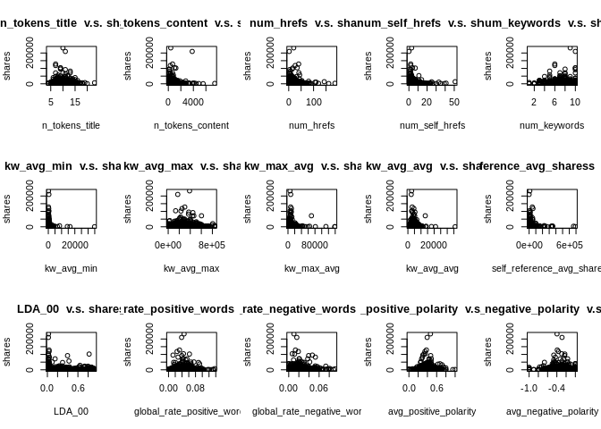

Project 1: predictive models
================
Min He
July 2, 2020 (updated 2020-07-03)

## Introduction about the data

This dataset summarizes a heterogeneous set of features about articles
published by Mashable in a period of two years. The goal is to predict
the number of shares in social networks (popularity).
[source](https://archive.ics.uci.edu/ml/datasets/Online+News+Popularity).
In this project, I will try to use the logistic regression and bagging
to classify whether the shares exceeds 1400 or not.

It includes the following columns:

0.  url: URL of the article (non-predictive)
1.  timedelta: Days between the article publication and the dataset
    acquisition (non-predictive)
2.  n\_tokens\_title: Number of words in the title
3.  n\_tokens\_content: Number of words in the content
4.  n\_unique\_tokens: Rate of unique words in the content
5.  n\_non\_stop\_words: Rate of non-stop words in the content
6.  n\_non\_stop\_unique\_tokens: Rate of unique non-stop words in the
    content
7.  num\_hrefs: Number of links
8.  num\_self\_hrefs: Number of links to other articles published by
    Mashable
9.  num\_imgs: Number of images
10. num\_videos: Number of videos
11. average\_token\_length: Average length of the words in the content
12. num\_keywords: Number of keywords in the metadata
13. data\_channel\_is\_lifestyle: Is data channel ‘Lifestyle’?
14. data\_channel\_is\_entertainment: Is data channel ‘Entertainment’?
15. data\_channel\_is\_bus: Is data channel ‘Business’?
16. data\_channel\_is\_socmed: Is data channel ‘Social Media’?
17. data\_channel\_is\_tech: Is data channel ‘Tech’?
18. data\_channel\_is\_world: Is data channel ‘World’?
19. kw\_min\_min: Worst keyword (min. shares)
20. kw\_max\_min: Worst keyword (max. shares)
21. kw\_avg\_min: Worst keyword (avg. shares)
22. kw\_min\_max: Best keyword (min. shares)
23. kw\_max\_max: Best keyword (max. shares)
24. kw\_avg\_max: Best keyword (avg. shares)
25. kw\_min\_avg: Avg. keyword (min. shares)
26. kw\_max\_avg: Avg. keyword (max. shares)
27. kw\_avg\_avg: Avg. keyword (avg. shares)
28. self\_reference\_min\_shares: Min. shares of referenced articles in
    Mashable
29. self\_reference\_max\_shares: Max. shares of referenced articles in
    Mashable
30. self\_reference\_avg\_sharess: Avg. shares of referenced articles in
    Mashable
31. weekday\_is\_monday: Was the article published on a Monday?
32. weekday\_is\_tuesday: Was the article published on a Tuesday?
33. weekday\_is\_wednesday: Was the article published on a Wednesday?
34. weekday\_is\_thursday: Was the article published on a Thursday?
35. weekday\_is\_friday: Was the article published on a Friday?
36. weekday\_is\_saturday: Was the article published on a Saturday?
37. weekday\_is\_sunday: Was the article published on a Sunday?
38. is\_weekend: Was the article published on the weekend?
39. LDA\_00: Closeness to LDA topic 0
40. LDA\_01: Closeness to LDA topic 1
41. LDA\_02: Closeness to LDA topic 2
42. LDA\_03: Closeness to LDA topic 3
43. LDA\_04: Closeness to LDA topic 4
44. global\_subjectivity: Text subjectivity
45. global\_sentiment\_polarity: Text sentiment polarity
46. global\_rate\_positive\_words: Rate of positive words in the content
47. global\_rate\_negative\_words: Rate of negative words in the content
48. rate\_positive\_words: Rate of positive words among non-neutral
    tokens
49. rate\_negative\_words: Rate of negative words among non-neutral
    tokens
50. avg\_positive\_polarity: Avg. polarity of positive words
51. min\_positive\_polarity: Min. polarity of positive words
52. max\_positive\_polarity: Max. polarity of positive words
53. avg\_negative\_polarity: Avg. polarity of negative words
54. min\_negative\_polarity: Min. polarity of negative words
55. max\_negative\_polarity: Max. polarity of negative words
56. title\_subjectivity: Title subjectivity
57. title\_sentiment\_polarity: Title polarity
58. abs\_title\_subjectivity: Absolute subjectivity level
59. abs\_title\_sentiment\_polarity: Absolute polarity level
60. shares: Number of shares in social media (this is the dependent
    variable)

## Read in the news popularity data

``` r
setwd("/home/aaron/Documents/NCSU_MinHe/ST558/project2_question")
pop_raw <- read.csv("OnlineNewsPopularity.csv", header = TRUE)
```

## Data preprocessing

  - Combine the weekday flags into one variable `news_day`, e.g.: when
    `weekday_is_monday`=1, set the `news_day`=‘Monday’
  - Combine the topic channels into one variable `data_channel`, e.g.:
    when `data_channel_is_lifestyle`=1, set the
    `data_channel`=‘lifestyle’
  - Dividing the shares into two groups (\< 1400 and ≥ 1400)

### Variables

  - Those non-predictive variables (url and timedelta) won’t be included
    in the model.
  - As in each model, we only use a subset of data (e.g.: Monday only),
    the weekday\_is\_monday, weekday\_is\_tuesday … will be combined
  - Basically, the vairables can be classified into the following
    classes
      - number of tokens (in title, content, keywords, stops, non-stops)
      - number of media in the article ( images, videos)
      - words characteristics (polarity, subjectivity, polarity,
        negative, positive, sentiment)
      - reference characteristics (shares of referenced, href)

<!-- end list -->

``` r
# Combine the weekday variables into one and set it to factor.
pop_raw$news_day <- rep("Sunday", nrow(pop_raw))
pop_raw$news_day[pop_raw$weekday_is_monday==1] <- "Monday"
pop_raw$news_day[pop_raw$weekday_is_tuesday==1] <- "Tuesday"
pop_raw$news_day[pop_raw$weekday_is_wednesday==1] <- "Wednesday"
pop_raw$news_day[pop_raw$weekday_is_thursday==1] <- "Thursday"
pop_raw$news_day[pop_raw$weekday_is_friday==1] <- "Friday"
pop_raw$news_day[pop_raw$weekday_is_saturday==1] <- "Saturday"
pop_raw$news_day <- factor(pop_raw$news_day) 

# Combine the channel variables into one and set it to factor.
pop_raw$data_channel <- rep('', nrow(pop_raw))
pop_raw$data_channel[pop_raw$data_channel_is_lifestyle==1] <- "lifestyle"
pop_raw$data_channel[pop_raw$data_channel_is_entertainment==1] <- "entertainment"
pop_raw$data_channel[pop_raw$data_channel_is_bus==1] <- "business"
pop_raw$data_channel[pop_raw$data_channel_is_socmed==1] <- "socmed"
pop_raw$data_channel[pop_raw$data_channel_is_tech==1] <- "tech"
pop_raw$data_channel[pop_raw$data_channel_is_world==1] <- "world"
pop_raw$data_channel <- factor(pop_raw$data_channel) 

pop_raw$shares_flag <- as.factor(pop_raw$shares>=1400)
```

## Clearing data

  - Remove the unused/non-predictive variables
  - Remove outliers (e.g.: n\_tokens\_content\<=0)
  - Subset the records to the day defined by the argument

<!-- end list -->

``` r
# Remove the non predictable variables
pop_raw<-pop_raw %>% subset(select=-c(url, timedelta, is_weekend, weekday_is_monday, weekday_is_tuesday, weekday_is_wednesday, weekday_is_thursday, weekday_is_friday, weekday_is_saturday,weekday_is_sunday, data_channel_is_lifestyle, data_channel_is_entertainment, data_channel_is_bus, data_channel_is_socmed, data_channel_is_tech, data_channel_is_world))

# filter out outliers
pop_raw_post <- pop_raw %>% filter( n_tokens_content > 0 & n_unique_tokens >= 0 & n_unique_tokens <=1.0 & n_non_stop_words>=0 & n_non_stop_words<=1.0 & n_non_stop_unique_tokens>=0 & n_non_stop_unique_tokens<=1.0)

pop_1_day <- pop_raw_post %>% filter(news_day == params$weekday) %>% subset(select=-c(news_day))
```

## Divide dataset into training v.s. testing datasets

  - Set random seeds so that the results can be replicated
  - Break the dataset into 70% for training v.s. 30% for testing

<!-- end list -->

``` r
# Sampling the dataset into 80% : training data and 20% : test data:
set.seed(100)
popNewsTrain <- sample(nrow(pop_1_day),as.integer(nrow(pop_1_day)*0.7))
train.news = pop_1_day[popNewsTrain,]
test.news = pop_1_day[-popNewsTrain,]
```

## Data summary and exploratory analysis

### Boxplot for some of the key variables to identify the outliers

``` r
# summary of the raw pop data
par(mfrow=c(3,5))
kay_variable <- c('n_tokens_title','n_tokens_content','num_hrefs', 'num_self_hrefs','num_keywords','kw_avg_min','kw_avg_max','kw_max_avg','kw_avg_avg','self_reference_avg_sharess','LDA_00','global_rate_positive_words','global_rate_negative_words','avg_positive_polarity','avg_negative_polarity')
for (col in kay_variable){
  boxplot(train.news[,col], xlab=col) 
}
```

<!-- -->

### Scatterplot of the shares v.s. some othe key variables to identify the linear relationship (although we are using logistic linear regression, but the scatterplot is still useful to identify the patterns)

``` r
par(mfrow=c(3,5))
for (col in kay_variable){
  plot(train.news[,col], train.news[,'shares'],  main = paste(col, ' v.s. shares'), xlab = col, ylab = 'shares')  
}
```

<!-- -->

### Histogram for key variables, it’s a good way to check the distribution (whether it’s normal distribution or not)

``` r
par(mfrow=c(3,5))
for (col in c('shares',kay_variable)){
  hist(train.news[,col],  main = paste('Histogram for ', col ), xlab = col, ylab = 'share')  
}
```

<!-- --><!-- -->

## Train the predictive model by using logistic regression

  - Use both direction (forwards and backwards) stepwise methods to pick
    up the predict variables
  - AIC is used as the criterion to pick the best combination of predict
    variables
  - AIC estimates the relative amount of information lost by a given
    model: the less information a model loses, the higher the quality of
    that model. (excerpted from [linked
    wiki](https://en.wikipedia.org/wiki/Akaike_information_criterion))

<!-- end list -->

``` r
train.news <- train.news %>% subset(select=-c(shares))
test.news <- test.news %>% subset(select=-c(shares))

# Fit the full model 
# So try logistic regression model
full.model <- glm(shares_flag ~ ., data = train.news, family = "binomial")

# Stepwise regression model
step.model <- stepAIC(full.model, direction = "both", trace = FALSE)
```

## Predict the value for test dataset with the trained logistic model

  - If the predicted response is larger than 0.5, then it’s
    shares\>=1400
  - Calculate/print the confusion matrix

<!-- end list -->

``` r
predict_value <- predict(step.model,test.news,type = "response") 
glm_confusionMatrix <- confusionMatrix(data = as.factor(predict_value>0.5), reference = as.factor(test.news$shares_flag))
glm_confusionMatrix
```

    ## Confusion Matrix and Statistics
    ## 
    ##           Reference
    ## Prediction FALSE TRUE
    ##      FALSE   432  258
    ##      TRUE    344  628
    ##                                           
    ##                Accuracy : 0.6378          
    ##                  95% CI : (0.6142, 0.6609)
    ##     No Information Rate : 0.5331          
    ##     P-Value [Acc > NIR] : < 2.2e-16       
    ##                                           
    ##                   Kappa : 0.2673          
    ##                                           
    ##  Mcnemar's Test P-Value : 0.0005315       
    ##                                           
    ##             Sensitivity : 0.5567          
    ##             Specificity : 0.7088          
    ##          Pos Pred Value : 0.6261          
    ##          Neg Pred Value : 0.6461          
    ##              Prevalence : 0.4669          
    ##          Detection Rate : 0.2599          
    ##    Detection Prevalence : 0.4152          
    ##       Balanced Accuracy : 0.6328          
    ##                                           
    ##        'Positive' Class : FALSE           
    ## 

## Train the predictive model by using random forest

  - Set number of trees to be 200

<!-- end list -->

``` r
bagFit <- randomForest(shares_flag ~ ., data = train.news, mtry = ncol(train.news) - 1, ntree = 200, importance = TRUE)
```

## Predict the value for test dataset with the trained bagging model

  - If the predicted response is larger than 0.5, then it’s
    shares\>=1400
  - Calculate/print the confusion matrix

<!-- end list -->

``` r
bagPred <- predict(bagFit, newdata = dplyr::select(test.news, -shares_flag))
bag_confusionMatrix <- confusionMatrix(data = bagPred, reference = as.factor(test.news$shares_flag))
bag_confusionMatrix
```

    ## Confusion Matrix and Statistics
    ## 
    ##           Reference
    ## Prediction FALSE TRUE
    ##      FALSE   418  236
    ##      TRUE    358  650
    ##                                          
    ##                Accuracy : 0.6426         
    ##                  95% CI : (0.619, 0.6657)
    ##     No Information Rate : 0.5331         
    ##     P-Value [Acc > NIR] : < 2.2e-16      
    ##                                          
    ##                   Kappa : 0.275          
    ##                                          
    ##  Mcnemar's Test P-Value : 6.881e-07      
    ##                                          
    ##             Sensitivity : 0.5387         
    ##             Specificity : 0.7336         
    ##          Pos Pred Value : 0.6391         
    ##          Neg Pred Value : 0.6448         
    ##              Prevalence : 0.4669         
    ##          Detection Rate : 0.2515         
    ##    Detection Prevalence : 0.3935         
    ##       Balanced Accuracy : 0.6361         
    ##                                          
    ##        'Positive' Class : FALSE          
    ## 

## Conclusion

The bagging methods are using classification trees.

  - Create a bootstrap sample (same size as actual sample)
  - Train tree on this sample
  - Repeat B = 1000 times
  - The voting method will be applied to pick which class it will
    belong.

The results obtained from the bagging and logistic regression show
similar accuracy, and it’s about 63% of accuracy for Monday only data.

## Generate the report for all days automatically

``` r
#get unique days
```
